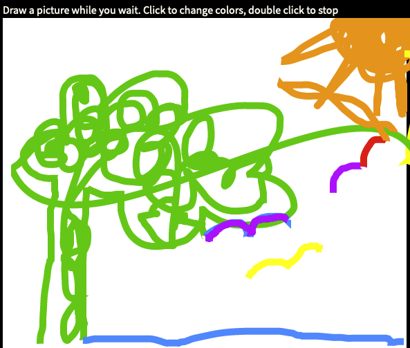
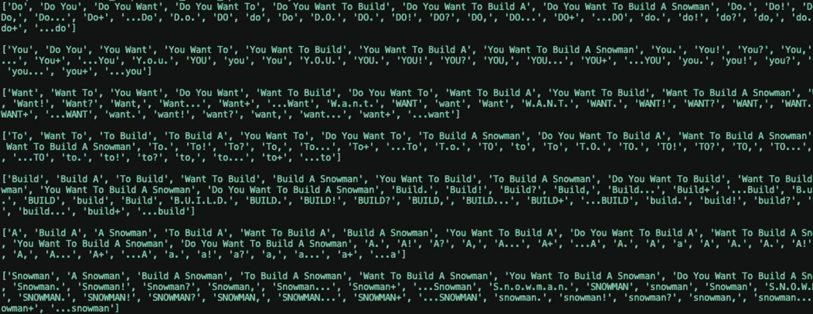
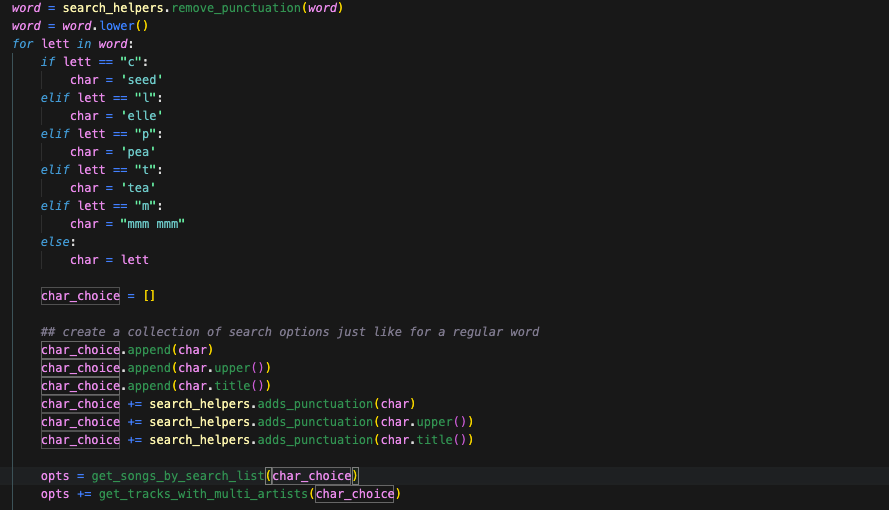
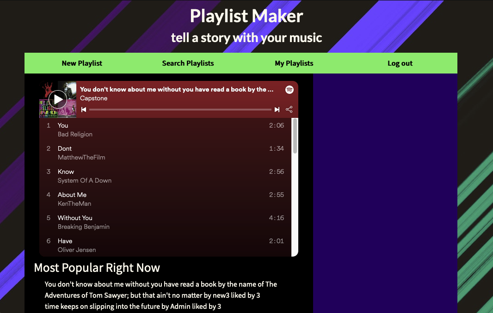

##### _by Kaitlin Rosen_

## Overview
PlaylistMaker is a way to create unique playlists that send clear, if playful, messages. Users give the app a phrase, and will be returned a playlist with each song writing out a piece of that phrase. A playlist called “The story so far: in the beginning, the universe was created. This has made a lot of people very angry and been widely regarded as a bad move” could be made up of songs like “The Story” by Brandi Carlile and “So” by Ed Sheeran, etc. until the end of the phrase. If no one has written a song called “been”, the app will pick songs like “B” by Jaden and “E” by Matt Mason to spell it out. 

## Features
- Users-input phrases become the tracklist for Spotify playlists
- User community allows for 
-- finding playlists
-- saving playlists
-- and managing created playlists
- Database connecting cached tracks, playlists and users

## Built With
- [Python](https://docs.python.org/3/) [Flask](https://flask.palletsprojects.com/en/2.1.x/) server with [Jinja](https://jinja.palletsprojects.com/en/3.1.x/)
- [PostgreSQL](https://www.postgresql.org/docs/) and [SQLAlchemy](https://docs.sqlalchemy.org/en/14/)
- [Spotipy library](https://spotipy.readthedocs.io/en/2.19.0/) and [Spotify Web API](https://developer.spotify.com/documentation/web-api/)
- [Javascript](https://developer.mozilla.org/en-US/docs/Web/JavaScript) and [Two.js](https://two.js.org/)
- HTML/CSS with [Bootstrap](https://getbootstrap.com/)

## Installation
Install requirements for the server are stored in requirements.txt.
```sh
cd SpotifyPlaylistMaker
pip3 install requirements.txt
```

For the dom manipulation of the web page, PlaylistMaker requires [Node.js](https://nodejs.org/) and [Two.js](https://two.js.org/) v10+ to run.
```sh
npm install --save two.js@latest
```

The server calls to Spotify require a Spotify Developer account.
[Open your account here](https://developer.spotify.com/documentation/web-api/)

Spotify will give you a client id and a client secret key, which must be stored in the environment for the app.


Spotify OAuth tokens for playlist creation require a redirect URI, which can be a local host, but must also be set in the environment for the app.
```sh
export SPOTIPY_CLIENT_ID=''
export SPOTIPY_CLIENT_SECRET=''
export SPOTIPY_REDIRECT_URI='http://localhost:5000'

## this is the admin account's Spotify id num
export APP_ID=''

## this is the flask server's secret key
export SECRET_KEY=''
```

PlaylistMaker currently writes all playlists to an admin Spotify account rather than specific user accounts. This is to allow for users without Spotify accounts to make playlists, or even users who would prefer not to connect until they see how it works, as Spotify OAuth tokens cannot be deleted with any call. Admin account's information will be taken and cached after the first API call, but it's suggested to also store the information in the environment

It's advised to use the same email for both your Spotify Developer account and the app's admin Spotify account.

## Build the Database
Included in PlaylistMaker is a JSON file (tracks.json) to help seed the database with songs from Spotify without having to make numerous API calls.

Seed.py does not build an admin user, but creating one using the Spotify Developer account or the admin Spotify account is advised for testing.

## UX and Code behind it
First, users input the name of their playlist, which is sent with an AJAX request to the server to filter through the database. While the server runs, an interactive canvas is generated for the user to draw with.


The database creates search queries out of common versions of the word used in track titles (including instances when a guest artist is featured in the title) and ngrams of the word within the phrase.


If no matches to any query is found within the database, the server makes at most 10 API calls to Spotify to look for more and cache all results. Each call returns 50 tracks; if a match isn't found in that time it won't be found at all, and the server will repeat the process with each letter in the word after the user selects songs from the other results.


The track title, artist name, and unique Spotify ID number for each song that matches a piece of their message is sent to the client so the user can customize the playlist track list. The chosen ID numbers go back to the server with another AJAX request, so the server can make two API calls to Spotify to first create a playlist for the user, and then fill it with their songs.


That playlist’s unique ID is sent to the client where it’s put in an embedded playlist object for immediate listening. 

## V2 Features in development
- Making playlists sharable within the app and outside of it
- Genre-specifying with playlist creation


